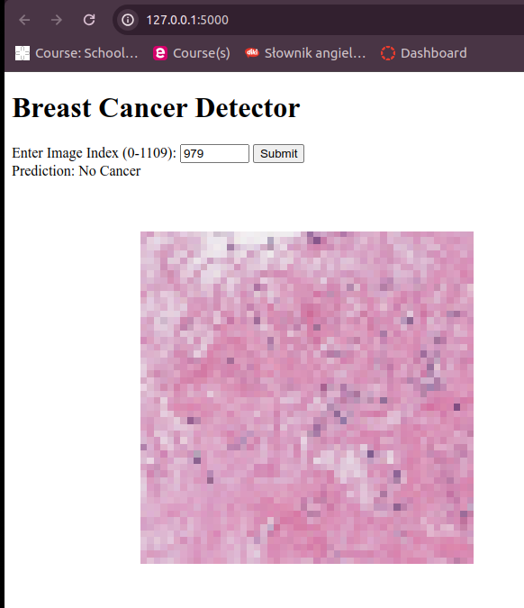

# CancerDetector

## Overview

`CancerDetector` is a Flask-based web application that uses a machine learning model to predict the presence of breast cancer in histopathological images.



## Model Details

The application employs a Random Forest classifier, which has been trained on a standardized dataset of 50x50 pixel histopathological images. Each image is labeled with one of two possible categories: `Cancer` or `No Cancer`.

## Installation

To get `CancerDetector` up and running on your local machine, follow these instructions:

### Prerequisites

- Python 3.8 or higher
- pip package manager
- git version control system

### Clone the Repository

First, clone the repository using git:

```bash
git clone https://github.com/LucyNowacki/CancerDetector.git
cd CancerDetector
```
### Install Dependencies
Install the necessary dependencies by running:

pip install -r requirements.txt

### Start the Application
Launch the application with Flask's built-in server:

flask run

### Usage

Once the server is running, navigate to http://127.0.0.1:5000 in your browser. Through the user interface, you can upload an image or enter an image index to obtain a prediction.

### Deployment

CancerDetector can be deployed to various cloud platforms, such as Heroku, AWS, or GCP. Detailed deployment instructions can be found in the Heroku Python documentation.

### Contributing

Contributions to CancerDetector are welcome. Please fork the repository, make your changes, and submit a pull request for review.

### License

This project is released under the MIT License. Please see the LICENSE file in the repository for more details.

### Contact

Should you have any questions or require assistance with CancerDetector, feel free to open an issue in the GitHub repository.


